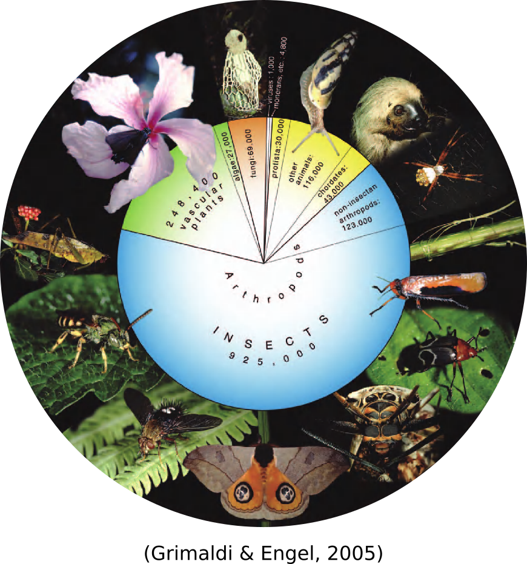
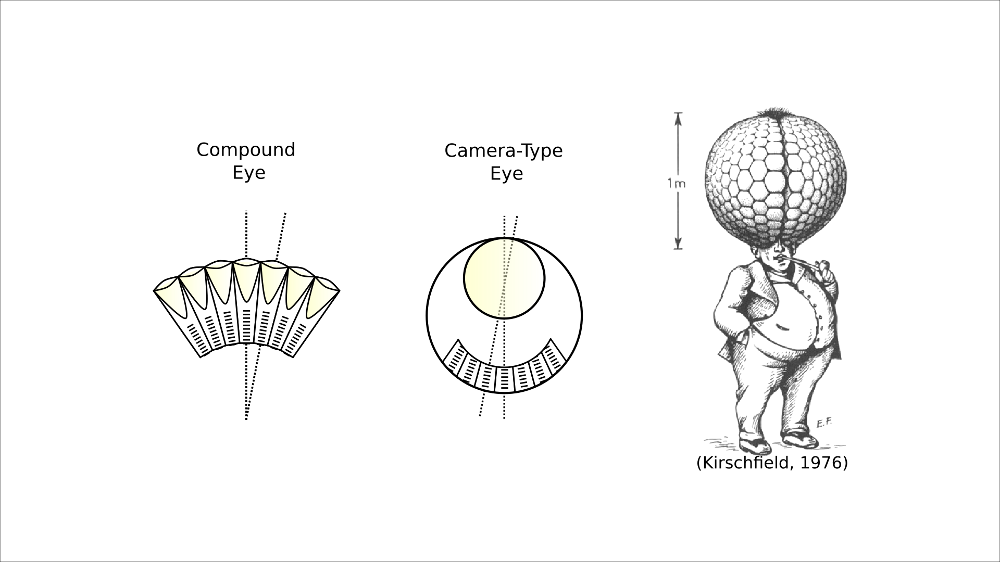

# Compound Eye Tools

This library automates counting and measuring the ommatidia of compound eyes from images.

## On Counting Ommatidia

My graduate mentor once challenged me to count the ommatidia of the eyes of vinegar flies (a.k.a. fruit flies and _Drosophila melanogaster_). Vinegar flies have two compound eyes, each composed of _hundreds_ of light collecting facets called ommatidia. I learned this very quickly as I counted the ommatidia of over 100 flies, amounting to over _90,000_ ommatidia (and [a publication in Vision Research](https://www.sciencedirect.com/science/article/pii/S0042698918300919))!

||
|:--:|
|*Over 90,000 ommatidia from over 100 flies counted by hand! The geometric arrangement made it possible to count large triangles of ommaitida without having to count individuals.*|

This a greuling task that many have braved before me. But why? Counting ommatidia is actually a worthwile endevour. Compound eyes are wielded by arthropods (mostly insects _really_), which represent roughly 80% of described animal species, occupying every ecological niche on Earth. They also come in a range of shapes and sizes, having adapted to different selective pressures. So if you want to understand how vision works, develops, and evolves, you have to study compound eyes. 

The number and size of ommatidia of a compound eye sets direct, physical limitations to what they can see. Each ommatidia sits immediately adjacent to the next, separated by screening pigment (see below). The angle separating neighboring ommatidia, called the interommatidial angle, determines the smallest resolvable detail like the inter-receptor angle of our own camera-type eyes. Each ommatidium collects an approximate pixel of the image captured by the retina so that large ommatidia offer greater sensitivity to low light levels. So, by counting and measuring ommatidia, we can figure out a great deal about an animal's spatial resolution and light sensitivity. 

||
|:--:|
|*The camera-type eye can have a higher spatial resolution because one lens serves the whole retina. For the compound eye to acheive the same resolution as our eyes, for instance, they would need to be at least 1 meter in diameter and composed of millions of ommatidia!*|

