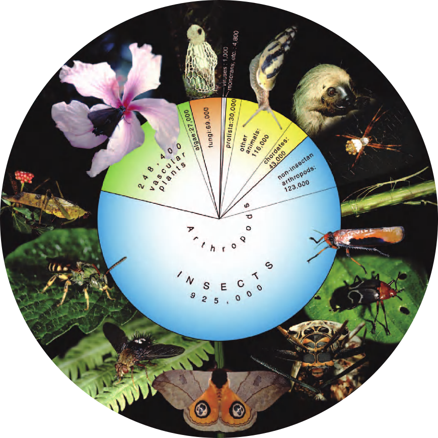

# Compound Eye Tools

This library automatically counts and measures the ommatidia of compound eyes from images.

## On Counting Ommatidia

My graduate mentor once challenged me to count the ommatidia of vinegar flies (a.k.a. fruit flies, _Drosophila melanogaster_). I quickly learned that they have two compound eyes, each composed of _hundreds_ of light collecting facets called ommatidia. I learned as I counted the ommatidia of over 100 flies, amounting to over _90,000_ ommatidia (and [a publication in Vision Research](https://www.sciencedirect.com/science/article/pii/S0042698918300919))!

||
|:--:|
|*Over 90,000 ommatidia from over 100 flies counted by hand! The geometric arrangement allowed me to count large triangles of ommaitida instead of individuals. Still, a lot of counting.*|

Many have braved this greuling task of counting ommatidia because, among other things, compound eyes are the most common image forming structures on Earth. Compound eyes are wielded by arthropods, which occupy nearly every ecological niche and represent roughly 80% of described animal species (the massive blue slice of the pie of life below). Compound eyes vary substantially in shape and size, having adapted to the gamut of selective pressures. So, to understand how vision works, develops, and evolves, we must study compound eyes. 

||
|:--:|
|*The Pie of Life: note the large blue pie representing the arthropods (pronounced "insects")*|

Plus, as opposed to our camera-type eyes, many of the structures limiting the visual performance of compound eyes can be measured in direct external images. The number and size of ommatidia of a compound eye set physical limitations on what they can see. Each ommatidium collects an approximate pixel of the image captured by the retina and sits immediately adjacent to the next, separated by screening pigment (see below). The angle separating neighboring ommatidia, called the interommatidial angle, determines the smallest resolvable detail just like the inter-receptor angle of our own camera-type eyes. Also, the size of the ommatidial aperture limits the amount of light available for absorption so that large ommatidia offer greater sensitivity to low light levels. By counting and measuring ommatidia, we can figure out a great deal about an animal's spatial resolution and light sensitivity. 

||
|:--:|
|*The camera-type eye can have a higher spatial resolution because one lens serves the whole retina. For the compound eye to acheive the same resolution as our eyes, for instance, they would need to be at least 1 meter in diameter and composed of millions of ommatidia!*|

But wouldn't it be nice if a program could count them automatically? Humanity's developed programs that can beat grand champions in chess or generate fake videos of past presidents. If we can automate driving cars or facial recognition, shouldn't we be able to automate ommatidia recognition?
